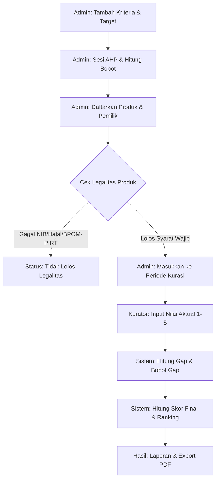

# PRD — Sistem Pendukung Keputusan (DSS) Kurasi Produk UMKM
## Kabupaten Sidoarjo

Sistem ini dirancang untuk mendigitalkan dan mengobjektifkan proses kurasi produk pangan UMKM di Kabupaten Sidoarjo menggunakan metode hybrid **AHP** (untuk pembobotan) dan **Profile Matching** (untuk pemeringkatan).

---

## 1. Visi & Tujuan
Proses kurasi manual seringkali subjektif dan sulit dipertanggungjawabkan. Sistem ini hadir untuk:
- **Objektivitas**: Menghilangkan bias personal dalam penilaian.
- **Transparansi**: Memberikan alasan logis (gap analisis) mengapa sebuah produk lolos atau tidak.
- **Efisiensi**: Mempercepat proses perolehan hasil dari ribuan produk UMKM.

---

## 2. Peran Pengguna (User Roles)

| Peran | Tanggung Jawab Utama |
| :--- | :--- |
| **Admin** | Mengelola Kriteria, mengatur Bobot AHP, Manajemen Produk (Data Master), dan memantau seluruh Periode Kurasi. |
| **Kurator** | Melakukan penilaian lapangan/aktual terhadap produk pada periode yang sedang berjalan. |

---

## 3. Metodologi DSS (Logic Flow)

Sistem menggunakan dua algoritma utama yang bekerja secara berurutan:

### A. Analytical Hierarchy Process (AHP)
Digunakan untuk menentukan **Bobot Kepentingan** setiap kriteria.
1. **Pairwise Comparison**: Admin membandingkan kriteria A vs B (Skala Saaty 1-9).
2. **Consistency Check**: Sistem menghitung Consistency Ratio (CR). Harus **≤ 0.1** untuk dianggap valid.
3. **Output**: Nilai Prioritas (Eigenvector) yang akan menjadi pengali di tahap Profile Matching.

### B. Profile Matching
Digunakan untuk menghitung **Ranking Produk** berdasarkan kesesuaian dengan profil ideal.
1. **Gap Analysis**: `Gap = Nilai Aktual (Kurator) - Nilai Target (Admin)`.
2. **Bobot Gap**: Mengonversi nilai Gap menjadi bobot (0 s/d 5) sesuai tabel standar.
3. **Total Scoring**: `Final Score = Σ (Bobot Gap * Bobot AHP)`.
4. **Ranking**: Produk diurutkan berdasarkan Score tertinggi.

---

## 4. Detil Modul & Fitur

### 🛠️ Modul 1: Fondasi Sistem (Core)
Status: ✅ **DONE**
- **Autentikasi**: Sistem login aman untuk Admin dan Kurator. Dilengkapi fitur *Remember Me* dan proteksi logout (modal konfirmasi).
- **Dashboard Dynamic**: Tampilan berbeda untuk tiap role (Admin melihat statistik global, Kurator melihat tugas aktif).
- **UI/UX Consistency**: Menggunakan Bootstrap 4 dengan SCSS kustom untuk tampilan premium.

### 📋 Modul 2: Manajemen Kriteria & Skala
Status: ✅ **DONE**
- **CRUD Kriteria**: Admin dapat menambah/edit kriteria (Contoh: "Rasa", "Harga", "Higienitas").
- **Kategorisasi Aspek**: Setiap kriteria dikelompokkan ke dalam "Kualitas Produk" atau "Kemasan".
- **Target Nilai (1-5)**: Admin menetapkan skor ideal (profil target) untuk setiap kriteria.
- **Manajemen Skala (Rubrik)**: Setiap kriteria memiliki 5 tingkatan rubrik (1-5). Admin bisa mengaktifkan/nonaktifkan skala tertentu. Skala yang nonaktif tidak akan muncul di form kurator.

### ⚖️ Modul 3: Kalkulasi AHP (Pembobotan)
Status: ⏳ **PLANNED**
- **Matriks Perbandingan**: Antarmuka berbentuk tabel $n \times n$ di mana Admin mengisikan tingkat kepentingan antar kriteria (Contoh: Rasa 3x lebih penting dari Kemasan).
- **Auto-Reciprocal**: Jika Admin mengisi Rasa-Kemasan = 3, maka Kemasan-Rasa otomatis terisi 1/3.
- **Uji Konsistensi (CR)**: Sistem menghitung $\lambda_{max}$, CI, dan CR. Jika CR > 0.1, sistem akan meminta Admin merevisi matriks karena tidak konsisten.
- **Sesi AHP**: Setiap hasil perhitungan disimpan dalam satu "Sesi". Periode kurasi akan dikunci ke satu Sesi AHP tertentu agar perubahan bobot di masa depan tidak merusak history nilai masa lalu.

### 📦 Modul 4: Manajemen Produk & Legalitas
Status: ⏳ **PLANNED** (Schema Update Pending)
- **Data Master Produk**: Menyimpan nama produk, brand, nama pemilik, dan foto produk.
- **Filter Legalitas (Entry Barrier)**: Produk **WAJIB** memenuhi syarat berikut untuk bisa lanjut ke tahap penilaian:
    1. **NIB** (Wajib Ada)
    2. **Sertifikat Halal** (Wajib Ada)
    3. **BPOM atau SP-PIRT** (Wajib ada salah satu, diperbolehkan keduanya).
- **Status Produk**: Produk yang tidak lolos legalitas akan ditandai secara visual dan tidak akan masuk ke antrean penilaian Kurator. (is_aktif)    

### ✍️ Modul 5: Manajemen Periode & Penilaian (Kurator)
Status: ⏳ **PLANNED**
- **Batching (Periode Kurasi)**: Admin membuat periode (Contoh: "Kurasi IKM Sidoarjo 2024"). Admin memilih produk mana saja yang masuk ke periode ini.
- **Antrean Penilaian**: Kurator melihat daftar produk dalam periode aktif yang belum dinilai.
- **Form Penilaian**: Input nilai (1-5) berdasarkan rubrik aktif. Form menampilkan panduan deskripsi di setiap pilihan nilai untuk meminimalisir kesalahan input.
- **Progress Tracker**: Menampilkan persentase jumlah produk yang sudah vs belum dinilai oleh Kurator.

### 📊 Modul 6: Hasil, Ranking & Laporan
Status: ⏳ **PLANNED**
- **Mesin Perhitungan Profile Matching**: Sistem menghitung Gap (Aktual - Target), mengonversinya ke Bobot Gap, lalu mengalikannya dengan Bobot AHP untuk mendapatkan skor akhir.
- **Leaderboard**: Tabel ranking produk dari skor tertinggi ke terendah.
- **Catatan Evaluasi**: Produk yang mendapatkan nilai di bawah target akan mendapatkan catatan otomatis ("Perlu perbaikan di aspek X").
- **Export PDF**: Generasi laporan resmi per periode yang memuat data statistik, bobot yang digunakan, dan tabel ranking lengkap.

---

## 5. Development Roadmap (Next Steps)

1. **Phase 1**: Update Database (Alternatif) & Implementasi CRUD Produk UMKM.
2. **Phase 2**: Modul Filter Legalitas & Manajemen Periode.
3. **Phase 3**: Kalkulasi AHP (Matriks & Konsistensi).
4. **Phase 4**: Form Penilaian Kurator & Integrasi Profile Matching.
5. **Phase 5**: Reporting & Export PDF.

---

## 6. Alur Data & Arsitektur Database

### A. Lifecycle Produk (Data Flow)

### B. Arsitektur Tabel Core

| Tabel | Fungsi dalam DSS | Keterangan |
| :--- | :--- | :--- |
| `kriteria` | Master data parameter penilaian. | Menyimpan `target_nilai` (Profil Ideal). |
| `ahp_bobot` | Menyimpan hasil prioritas kriteria. | Hasil dari perbandingan berpasangan. |
| `alternatif` | Data master produk UMKM. | Ditambahkan `nama_pemilik` & `foto_produk`. |
| `penilaian_kurasi`| Transaksi nilai dari Kurator. | Menghubungkan Produk -> Kriteria -> Nilai. |
| `hasil_kurasi` | Output akhir perhitungan. | Menyimpan `skor_final` dan `peringkat`. |

---

## 7. Tech Stack
- **Backend**: Laravel 11.x (PHP 8.2+)
- **Frontend**: Blade, Bootstrap 4, SCSS, Lucide Icons
- **Build Tool**: Vite
- **Database**: MySQL